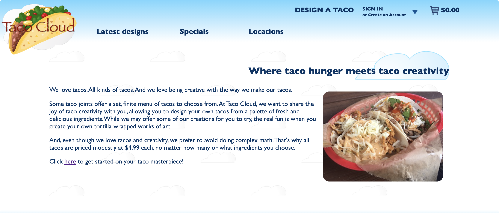
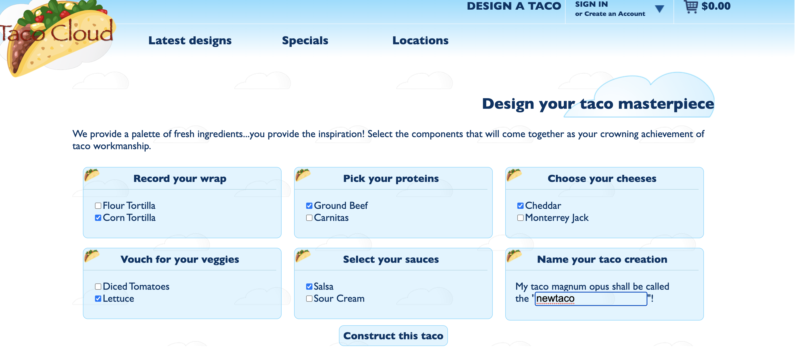
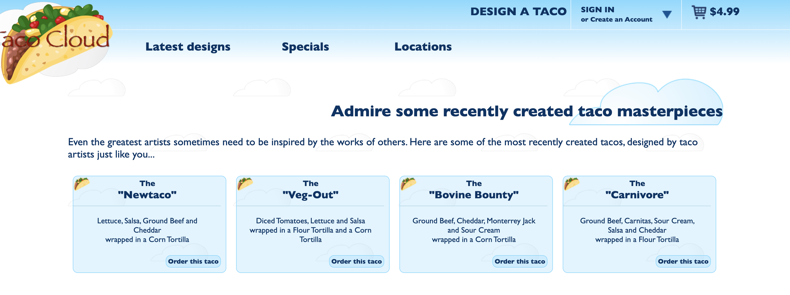
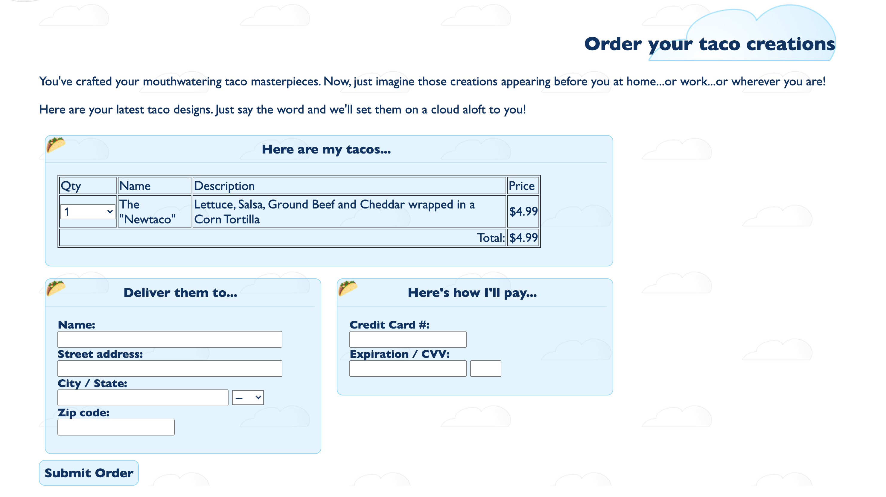

# TacoCloud
A online food e-commerce system using Spring framework(annotation-only).

# Description
A online food e-commerce system with the following features:
* design a customized taco
* order a designed taco or preset taco
* pick recently designed tacoes

# Running requirements 
* Spring framework
* related Maven dependencies
* Java

# Showcases of pages
* main page

* food design page

* recent design page

* order page(with cart)

